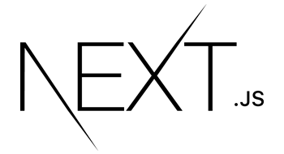

    

<h1>  Hi there I'm <a target="_blank" href="https://yigitcakmak.com">Yiğit Çakmak</a>!  </h1>

💡  Enthusiastic and dynamic software developer with a demonstrated working and never ending passion.  

 ❤️  Work to deepen in the fields I enjoy, to come to a good position in computer science with a solid education and experience, and to make the best contributions to this science.  

 ⚡  I am responsible and I self-organization myself wonderfully. I resolve issues and find best solutions. 

.

## Language & Tools

